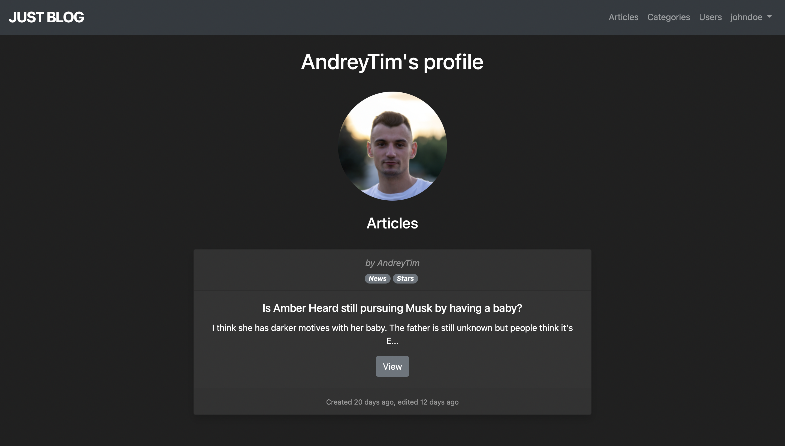

# Just Blog app
> Simple blog application created with Ruby on Rails, Bootstrap 4 and SQLite3
> Live demo [_here_](https://justblog-6.herokuapp.com).

## Table of Contents
* [General Info](#general-information)
* [Technologies Used](#technologies-used)
* [Features](#features)
* [Screenshots](#screenshots)
* [Project Status](#project-status)
* [Acknowledgements](#acknowledgements)
* [Contact](#contact)

## General Information
This application intended for reading articles of different users and for creating your own articles with categories

## Technologies Used
- Ruby on Rails - version 6.0.5
- Bootstrap - version 4.6
- SQLite3 database adapter

## Features
List the ready features here:
- One-to-many association between users and articles
- Many-to-many association between articles and categories
- Login using secure password
- Restriction of actions based on logged in/logged out state
- Admin user functionality and access level

## Screenshots

## Project Status
Project is: _complete_

## Acknowledgements
- This project was based on [Ruby on Rails course](https://www.udemy.com/course/the-complete-ruby-on-rails-developer-course/).

## Contact
Created by [@Andrey Timakhovich](https://www.linkedin.com/in/andrey-timakhovich-5a2429169/) - feel free to contact me!
